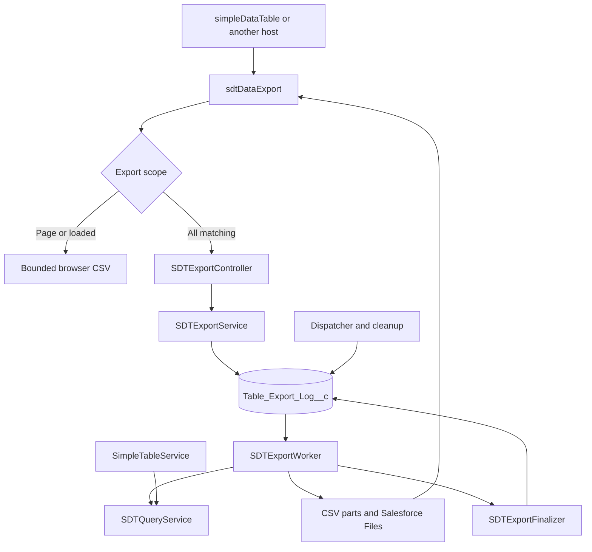
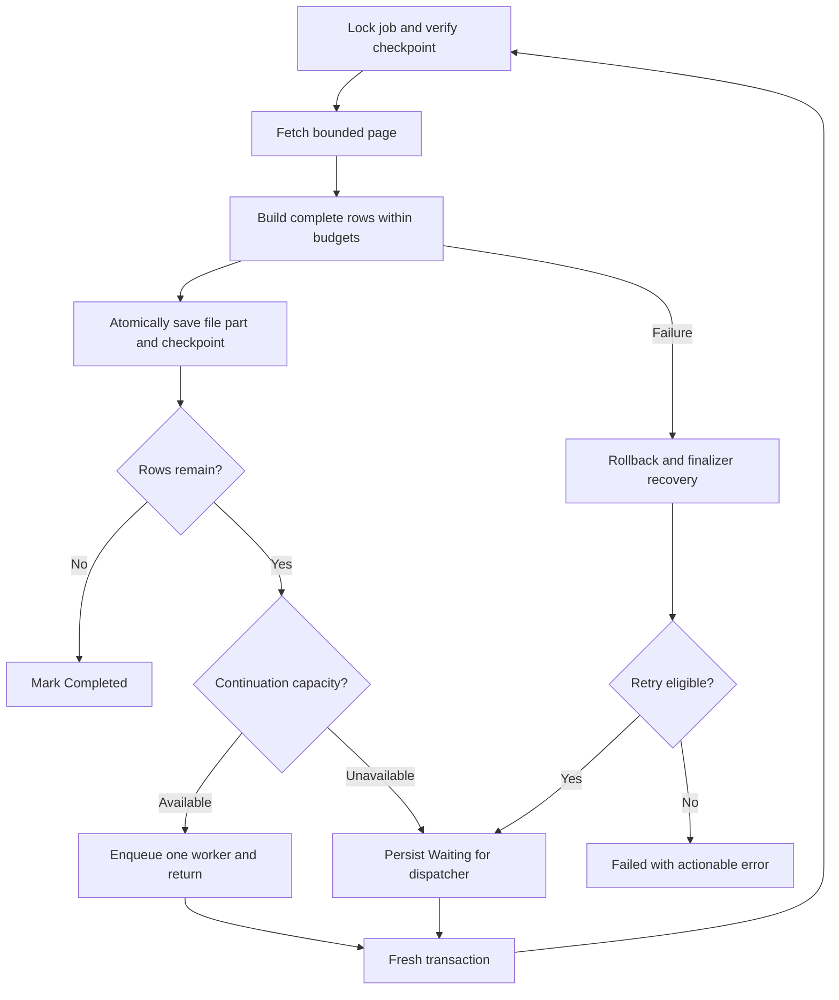
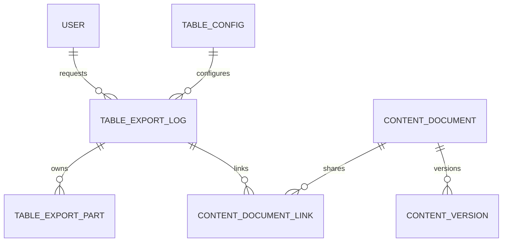

# Bulk CSV export scope and architecture

Version 1.1 | 5 October 2026 | Planned export implementation

## 10A Export scope and decisions

Status: architecture selected for implementation on 5 October 2026. Export components, worker and metadata extensions described in Section 10 are planned; this document update does not implement or deploy them.

Build a reusable sdtDataExport LWC with its own SDTExportController and SDTExportService. Support CSV for Current page, Loaded results and All matching records. Current page and Loaded results use already-loaded data when supplied; All matching always creates a background job. No claim of unlimited rows or a guaranteed completion time is made.

Default to visible columns in current order; optionally include all permitted configured columns. Preserve labels, parent context, search, validated AND or OR or custom filter logic and supported server sort. Lookup columns export their readable configured display value. Record IDs are an optional explicit output option. CSV uses escaped quotes, commas and line breaks, spreadsheet formula protection, consistent date formats and numeric values without currency decoration.

Initial scope includes file-part downloads, processed-row and byte counters, owner-only job access, status polling, cancellation between transactions, bounded retry, cleanup and tests. Optional totals use persisted partial sum, count, minimum and maximum; average is derived from total sum and applicable count. A final summary is a separate CSV part, never a recombination of all output.

Excluded: XLSX, PDF, matrix or pivot export, single huge CSV assembled in Apex, ZIP assembly, external streaming or Bulk API integration, arbitrary client SOQL, point-in-time data snapshots, email delivery and automatic restart with changed configuration. These require separate scope.

The first implementation delivers the complete bounded background CSV route. The earlier suggestion to defer all bulk export to a later phase is superseded. Local page and loaded exports are conveniences; they do not replace the bulk route.

| Decision | Selected behaviour |
| --- | --- |
| Output | One or more independently readable CSV parts with headers |
| Worker state | Only export job ID and small expected checkpoint or generation |
| Transactions | Commit output part and checkpoint together; next worker gets fresh limits |
| Capacity | Configured row and file limits; production cap follows representative load tests |
| UI lifecycle | Closing the page does not cancel a submitted background job |

## 10B Component architecture

The table passes export context to sdtDataExport. The exporter can also be used by another host that supplies a table configuration and context. It must not import table internals or own the table filter UI. Browser export may accept a bounded rows input; bulk export always fetches server data.

Extract validated configuration and query construction from SimpleTableService into SDTQueryService with a regression-tested table adapter. Table and export use the same query semantics but different fetch policies: the table keeps its existing LIMIT 2000 and the export uses bounded continuation queries. Do not invoke getData repeatedly as a substitute for a bulk engine.

Freeze column keys, labels, types, display paths, lookup paths, filters, parent context, sort and settings version in the persisted request. Resolve keys against saved configuration before storing the snapshot. Recheck permissions during worker reads; the frozen request does not grant extra access.

| Proposed component | Responsibility |
| --- | --- |
| sdtDataExport | Scope and column options, job progress, cancel and file download |
| sdtCsvBuilder | Bounded browser CSV conversion and escaping |
| SDTExportController and DTO | startExport, getExportStatus, listParts, cancelExport and retryExport contracts |
| SDTExportService and Selector | Request validation, job lifecycle, owner access and persistence |
| SDTQueryService | Shared configured query, access checks and continuation predicates |
| SDTExportWorker | One bounded Queueable transaction; job ID constructor |
| SDTExportFinalizer | Separate transaction for failed-job reporting and bounded recovery |
| SDTExportDispatcher and Cleanup | Resume eligible jobs within async capacity; expire retained files |

## 10C Transaction and checkpoint flow

Submission validates access and configured limits, persists an immutable request and enqueues a worker in one transaction. The worker attaches a lightweight finalizer, locks the job, checks status and expected generation, then fetches a small page. Keep all record and CSV buffers local to this execute method.

Process rows while measuring heap, CPU and estimated output bytes. Flush before the soft thresholds when a complete row can be committed safely. Persist ContentVersion, the part manifest, counters, partial totals and the last processed sort tuple in the same transaction. Advance the checkpoint only for rows included in a successfully saved part.

If rows remain, enqueue at most one child worker and return. A fresh transaction begins when Salesforce schedules that job, not immediately inside the current method. If capacity or chain-depth rules prevent continuation, leave a resumable Waiting state for the dispatcher. Never pass the current records, Blob or CSV buffer to another job.

Do not use OFFSET for bulk continuation. Use the validated sort field plus Id as a deterministic tie breaker, with an explicit null phase and typed checkpoint values. Support only scalar sortable fields for which a correct continuation predicate can be generated. Reject unsupported bulk sorts with an actionable message instead of silently changing order.

This is a live export: request settings are frozen, but record values and membership can change during execution. A created-time upper bound excludes newly created records where supported; updates and deletions may still change results. It is not a database snapshot. Retry guarantees concern committed parts and checkpoints, not historical consistency.

## 10D Limits and bounded execution

Read Limits.getHeapSize and getLimitHeapSize during processing. Also monitor getCpuTime, getLimitCpuTime, query rows, DML and async enqueue capacity. Hard limits remain platform-enforced; monitoring does not guarantee that a single query, record or allocation cannot exceed them before the next check.

Provisional tuning values are 100 fetched rows per worker, adaptive range 1 to 500 rows, 40 percent heap and 50 percent CPU soft thresholds, and a 1 MiB target CSV part. These are engineering starting points, not Salesforce limits or tested capacity promises. Lower them when long text, wide columns, conversion or file-insert automation consumes more resources.

Reserve memory for the current records, escaped row, joined CSV, Blob conversion, File DML and automation. Estimate output bytes before expanding buffers; do not rely on string length alone as an exact memory measurement. Saving a part or setting variables to null does not create a new transaction or guarantee immediate garbage collection.

A row that cannot fit within the configured safe budget must fail explicitly with the field or row context, or require the user to reduce columns. Do not silently truncate data or loop forever retrying an oversized row. Fetch count reduction is bounded and cannot rescue every possible record.

Resolve the actual target-org limits at runtime. Older heap allowances are 6 MB synchronous and 12 MB asynchronous; Winter 27 release notes increase them to 10 MB and 25 MB where available. CPU allowances are 10 seconds synchronous and 60 seconds asynchronous. CPU time is not a wall-clock completion promise.

Async daily allocations, configured chain depth, worker concurrency, query selectivity and Files storage must also be respected. UI polling reports Queued, Processing, Waiting, Completed, Failed or Cancelled; elapsed UI time alone must not mark a still-running job failed. A lease and finalizer or dispatcher detect abandoned execution.

| Risk | Required control |
| --- | --- |
| Heap or instance too large | Job ID only in worker; bounded local buffers; no Database.Stateful CSV |
| Query and CPU pressure | Selected fields only, selective filters, bounded fetch and no row-level SOQL |
| File or total-size limit | Per-part byte cap and configured maximum rows, bytes and parts |
| Resource starvation | Per-user active-job cap, concurrency control and dispatcher backoff |

## 10E Persistence and relationships

Reuse Table_Export_Log__c as the job record and Table_Export_Setting__mdt for existing export policies. Both exist in the baseline metadata but are not a working runtime export engine. Add a proposed Table_Export_Part__c child linked to the log. Naming and field extensions below are a design contract, not deployed metadata.

Keep the existing User lookup as the requester. Existing log fields cover status, counts, start and completion times, errors, output format and chunk size. Existing settings include Client_Export_Threshold, Sync_Row_Limit, Max_Standard_Export_Rows, Max_CSV_Chunk_Size_MB and Export_Retention_Days. Extend these only for missing policies, rather than introducing a competing settings object.

Files attach to the private export log through ContentDocumentLink. A part stores ContentVersionId for the exact generated version; a Text field is an identifier reference, not a custom lookup to ContentVersion. Requester access to the log, manifest and File must be consistent. Cleanup deletes only export-owned documents that are eligible under retention and sharing rules.

| Record | Proposed field additions and relations |
| --- | --- |
| Table_Export_Log__c | Table_Config lookup to Table__c; Request_JSON; Checkpoint_JSON; Next_Part_Number; Output_Bytes; Part_Count; Retry_Count; Generation; Active_Async_Job_Id; Last_Heartbeat; Lease_Expires_At; Cancel_Requested; Expires_At |
| Table_Export_Part__c | Master-detail Export_Log to Table_Export_Log__c; Part_Number; unique Job_Part_Key; Content_Version_Id Text 18; Row_Count; Byte_Count; First_Checkpoint_JSON; Last_Checkpoint_JSON; Partial_Totals_JSON; Part_Type |
| Table_Export_Setting__mdt | Additional heap and CPU soft percentages; Fetch_Row_Limit; Max_Output_Bytes; Max_Parts; Max_Retry_Count; Max_Active_Jobs_Per_User; Poll_Interval_Seconds |
| User and Files | User -> export log -> part manifests; export log -> ContentDocumentLink -> ContentDocument -> ContentVersion |

Payload/checkpoint Long Text Area lengths must be chosen explicitly and validated before DML. Reject an oversized frozen request. Persist only bounded per-part totals and checkpoint tuples, never a full result list or accumulated output string.

## 10F Retry security and cancellation

All server methods verify that the caller owns the job or has explicitly granted admin access. Execute record reads with sharing and explicit object and field access enforcement. Validate export fields against the saved configuration; use bound continuation values where supported. Never trust client field paths, URLs or SOQL.

The same transaction writes the file part, unique job-and-part key and checkpoint. A failure rolls these changes back together. Workers lock and verify the expected generation or checkpoint so duplicate submissions and retries cannot advance the same part twice. Retry from the last committed checkpoint; never advance for an unsaved row.

The finalizer runs separately and can record failures that rolled back the worker transaction. Recover transient failures using a proposed maximum of three attempts, resource-aware smaller fetches and backoff. Permanent validation, permission, oversized-row or storage failures require user action. The finalizer must remain lightweight and is not an unlimited recovery guarantee.

Cancellation is checked at transaction boundaries and before output persistence. It does not kill an already-running transaction immediately. Completed parts on Failed or Cancelled jobs are labelled partial and are not offered as a successful full export. A corrected request starts a new job; a retry preserves the original request.

Polling stops when the UI disconnects; the job continues. Fetch status with a proposed five-second interval and backoff while waiting, without repeated full-data requests. Download only authorized persisted Files; do not expose a global public file link by default.

CSV formula protection covers leading spreadsheet formula markers and relevant control characters. Escape every textual cell and quote according to CSV rules. Keep numeric output typed before formatting so negative numbers are not accidentally converted to formula-like text. Log operational context without retaining unnecessary sensitive row values.

| Status | Meaning |
| --- | --- |
| Queued or Waiting | Accepted; scheduling or capacity prevents immediate processing |
| Processing | Worker is executing; processed count reflects committed rows |
| Completed | All required parts are persisted and accessible |
| Failed | Terminal failure; partial parts are clearly identified |
| Cancelled or Expired | User stopped continuation, or retained output was cleaned up |

## 10G Implementation and acceptance plan

Step 1: inspect the latest branch metadata and target package ownership; confirm log/settings reuse, field sizes, status picklist extensions and new part-object deployment. Add permission sets and tests. Freeze the DTO contract and build the request/job selectors.

Step 2: extract the shared query layer while preserving existing table requests and results. Test search, parent context, AND or OR or custom logic, relationship paths, permissions, sorting and LIMIT 2000. Implement sort-aware checkpoint predicates with tie and null cases before using them for bulk export.

Step 3: build the Queueable worker, CSV formatter, atomic manifest/checkpoint writes, finalizer, dispatcher, cancellation and cleanup. Simulate rollback, repeated dispatch, stalled workers and permission changes. Keep the worker constructor restricted to the job identifier and small control values.

Step 4: build the independent export UI and table integration. Add Current page and Loaded results using bounded inputs, bulk start/status/download, explicit part labels and optional final totals. Validate downloads with Excel and another CSV parser.

Step 5: perform representative target-org load tests before publishing a row cap. Measure transaction heap and CPU, query duration, CSV bytes, File insertion, queue delay, total runtime, part count and retry outcomes. Test both namespace and independent deployment paths.

| Acceptance area | Required evidence |
| --- | --- |
| Data correctness | Column order, lookup labels, parent filters, custom logic, escaping and totals |
| Continuation | Repeated sort values, nulls, ascending/descending, last partial page and live-data caveat |
| Recovery | No duplicate committed parts; no skipped checkpoint rows on retry; explicit terminal errors |
| Limits | Wide and long-text records; threshold headroom; oversized-row handling; async capacity |
| Security | Unauthorized job/file access denied; object/field access enforced |
| Regression | Existing table pagination, resize, links, filters, cards and aggregates remain correct |

Release gates: Apex semantic compilation and tests, LWC compilation, metadata/permission deployment, UI smoke tests and measured capacity must pass. No governor-limit safety or production capacity claim is made solely from a syntax check.

## 10H Branches status and sources

Section 1 through 9 retains the original eb5009d source inventory. This revision adds an implementation delta and the selected export design; the export components and field additions remain planned. The older AND-only and plain-text descriptions are superseded by the implemented features listed below.

Implemented since the original baseline: independent and namespace/shree-tech branches; horizontal scrolling and resizable persistent column widths; wrap/clip and refresh controls; improved numbered filter UI with validated AND, OR and custom logic; table/card record hyperlinks; configured lookup ID path priority; case-insensitive SOQL field deduplication; sticky table header CSS.

Code baseline for this document: independent da817ad67e840558e6594605be00c7cb8400ada0 and namespace/shree-tech 9ff58c0aa960c802f772a64e6f5f53e1a297937d. User confirmed filter and hyperlink fixes working; live verification of the newest sticky-header change and the proposed export implementation is not recorded.

Both branches receive the same reference DOCX, export architecture Markdown and Mermaid sources under doc. The namespace branch uses Shree_Tech__ configuration object and field references; the independent branch uses unprefixed APIs. New fields on namespaced package objects must be provisioned through the package-owned metadata workflow; the existing code-only namespace manifest cannot provision missing fields or the new part object.

The proposed exporter does not introduce another namespace branch or modify main. Implementation will follow the sequence in Section 10G after this scope record is committed. Future revisions must update the planned/implemented status, object dictionary, class inventory, tests and supported capacity together.

Apex limits: https://developer.salesforce.com/docs/atlas.en-us.apexcode.meta/apexcode/apex_gov_limits.htm

Heap monitoring: https://help.salesforce.com/s/articleView?id=000385712&language=en_US&type=1

Winter 27 heap update: https://help.salesforce.com/s/articleView?id=release-notes.rn_apex_heap_limit.htm&language=en_US&type=5

Queueable architecture: https://trailhead.salesforce.com/content/learn/modules/asynchronous_apex/async_apex_queueable

Finalizer transaction boundary: https://developer.salesforce.com/blogs/2020/01/learn-moar-in-spring-20-introducing-transaction-finalizers

